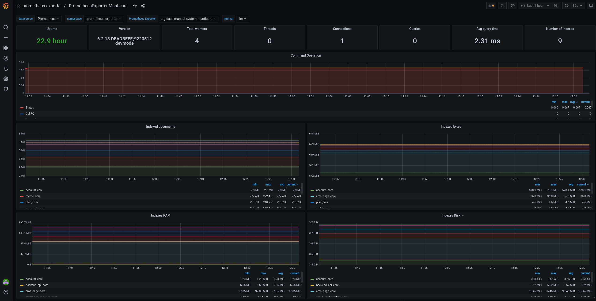
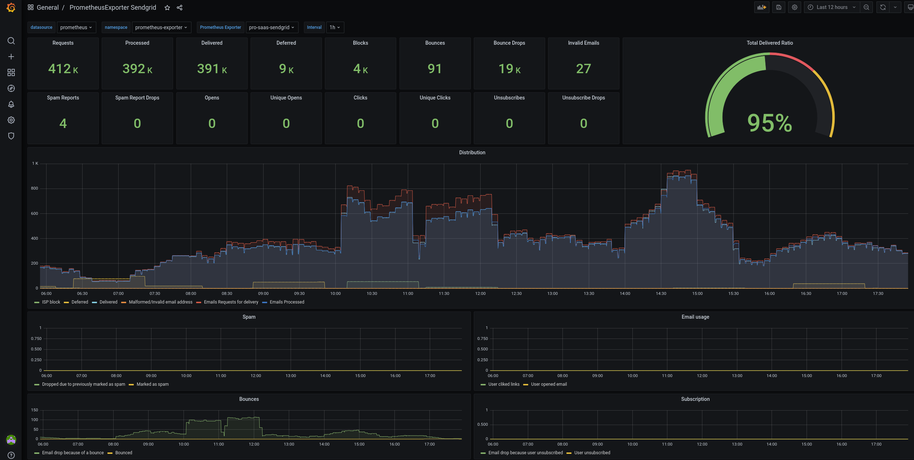

# Prometheus Exporter Operator

</img>

A Kubernetes Operator based on the Operator SDK to centralize the setup of 3rd party prometheus exporters on **Kubernetes/OpenShift**, with a collection of grafana dashboards.

By just providing a few parameters like _dbHost_ or _dbPort_ (operator manage the container image, port, argument, command, volumes... and also prometheus `ServiceMonitor` and `GrafanaDashboard` k8s objects), you can setup different prometheus exporters to monitor:

- The **internals from different databases**
- **HTTP/TCP endpoints** (availability, latency, SSL/TLS certificate expiration...)
- Any available **cloudwatch metric from any AWS Service**
- Sendgrid email statistics (delivered, bounces, errors. spam...)

Current prometheus exporters `types` supported, managed by same prometheus-exporter-operator:

- memcached
- redis
- mysql
- postgresql
- sphinx
- manticore
- es (elasticsearch)
- cloudwatch
- probe (blackbox)
- sendgrid

The operator manages the lifecycle of the following objects:

- Deployment (one per CR)
- Service (one per CR)
- ServiceMonitor (optional, one per CR)
- GrafanaDashboard (optional, one per Namespace)

> **NOTE** >  Some exporters need some **extra objects to be previously manually created** in order to work (**manual objects names need to be specified on required CR fields**). This extra needed objects includes **Secrets (credentials) or Configmaps (configuration files) on specific formats**. Examples to help you create these extra objects are provided on [examples](examples/) directory for all exporter types.
>   >  **If you modify the content of these extra needed objects (_Secrets_/_Configmaps_), exporters won't load them automatically, so you need to force a new pod creation by for example deleting the running pod.**

## Current status

Operator is available at [OperatorHub.io](https://operatorhub.io/operator/prometheus-exporter-operator) (on both Kubernetes/OpenShift OLM catalogs)

## Requirements

- [prometheus-operator](https://github.com/coreos/prometheus-operator) v0.17.0+
- [grafana-operator](https://github.com/integr8ly/grafana-operator) v3.0.0+

## Documentation

- [PrometheusExporter Custom Resource Reference](docs/prometheus-exporter-crd-reference.md)
- [Install](docs/install.md)
- [Development](docs/development.md)
- [Examples](examples/)
- [Release](docs/release.md)

## GrafanaDashboards

`GrafanaDashboards` management is included in the operator:

- For each CR, a `GrafanaDashboard` (optional, enabled by default `grafanaDashboard.enabled: true`) is created, but actually operator manages a single dashboard type per Namespace (not per CR)
- If you deploy for example different redis CRs, and you want to have the redis dashboard created, you need to enabled it on every redis CR with the same grafana-operator label selector (but actually, operator will just manage a single dashboard per Namespace shared accross all CRs from the same type)
- You can deploy the prometheus-exporter-operator with different operator versions on different Namespaces, so operator will create separate dashboards per Namespace (they won't collision, that's why dashboard name includes the Namespace)
- All grafana dashboards are preconfigured to use `CR_NAME` as the filter of all possible dashboards of every type (for example `staging-system-memcached`)
- _In the future it is possible that `GrafanaDashboard` management get its own CRD separate from `PrometheusExporter` CRD (so you could have N PrometheusExporter CRs, and also an additonal single Dashboard CR per exporter type_

### Memcached example dashboard

</img>

### Redis example dashboard

</img>

### MySQL example dashboard

</img>

### PostgreSQL example dashboard

</img>

### Sphinx example dashboard

</img>

### Manticore example dashboard

</img>

### Elasticsearch example dashboard

</img>

### AWS CloudWatch example dashboard

</img>

### Blackbox probe example dashboard

</img>

### Sendgrid example dashboard

</img>

## PrometheusRules

`PrometheusRules` management is NOT included in the operator (at least by the moment), because it depends on:

- What you need to monitor (maybe ones just need basic cpu/mem alerts, while others may be interested on specific alerts checking internals of a database)
- Why you want to be paged (severity warning/critical, minutes duration before firing an alert...)
- Customizable thresholds definition (it is something that depends on infrastructure dimensions...)

However, some examples of prometheus rules can be found at [prometheus-rules](prometheus-rules/) directory.

## Contributing

You can contribute by:

- Raising any issues you find using Prometheus Exporter Operator
- Fixing issues by opening [Pull Requests](https://github.com/3scale-ops/prometheus-exporter-operator/pulls)
- Submitting a patch or opening a PR
- Improving documentation
- Talking about Prometheus Exporter Operator

All bugs, tasks or enhancements are tracked as [GitHub issues](https://github.com/3scale-ops/prometheus-exporter-operator/issues).

## License

Prometheus Exporter Operator is under Apache 2.0 license. See the [LICENSE](LICENSE) file for details.
